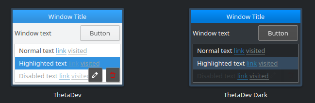
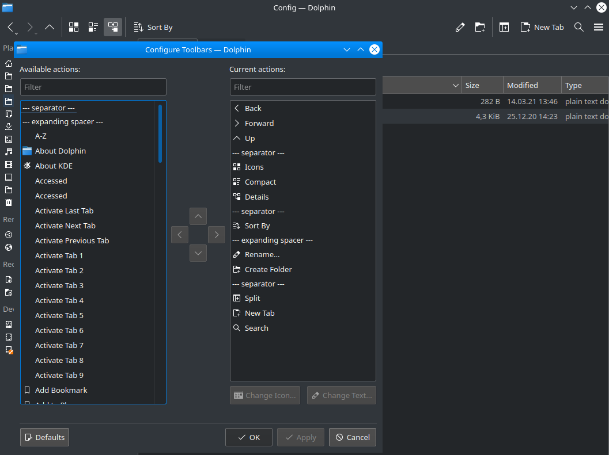

# KubuntuSetup

My Kubuntu setup. Used as a cheat sheet in case I have to set up my system again or on another PC.

Download Kubuntu: https://kubuntu.org/getkubuntu/

### Colors

ThetaDev / ThetaDev Dark color theme



Use the Install from File option to install them.

### Cursors

Copy `Win10Theta` cursor folder into `/usr/share/icons/`

### Filesystem

Currently I have my data on a seperate NTFS-formatted partition to allow access from Windows, too. Here is the fstab entry for it. Note that the `umask` (default file permissions) have to be set to that values, otherwise the trash can won't work (deleted files from the data partition will be copied to the system partition).

Get disk partition UUID: `blkid`

```
/etc/fstab
# DATEN
UUID=xxxxxxxxxxxxxxxx /media/Daten ntfs uid=1000,gid=1000,rw,user,exec,umask=0077 0 0
```

### System Settings

**Global Theme:** Breeze Dark

**Plasma Style:** Breeze AlphaBlack (download)

**AlphaBlack settings:**
Panel, Widget, Titlebars, Frames: #004275
Text color: #ffffff
Highlight color: #0078d7
Opacity: 90%

**Colors:** ThetaDev / ThetaDev Dark

**Fonts/Fixed width:** JetBrains Mono NL 10pt

**Cursors:** Win10Theta

**Workspace/General behavior:** Animation speed: 6/9

**Workspace/Desktop effects:**
Blur off, Maximize off, Translucency off

**Workspace/Screen edges:** Off

**Workspace/Screen locking/Appearance:** `pcb.jpg`

**Window management/Task switcher:** Thumbnail Grid, Show selected window OFF

**Window management/KWin Scripts:** Sticky Windows Snapping (download)

**Window management/Window rules:** `Config/chrome_miniplayer.kwinrule`

**Startup and Shutdown/Login Screen:** Background: `pcb.jpg`, Advanced > Settings synchronization

**Startup and Shutdown/Desktop session:** Confirm logout OFF, Applications to be excluded from sessions: `plasma-discover`

**Other notifications:** Application crashes OFF

**Regional settings/Spell Check:** Deutsch (Deutschland), `apt install hunspell-de-de-frami`

**Input devices/Touchpad:** Tap-to-click, Invert scroll direction

**Input devices/Display and Monitor/Compositor:** Keep window thumbnails: Always

**Hardware/Audio:** Notification sounds OFF

### Task manager settings

**Appearance:** Mark applications that play audio OFF, Maximum columns: 1

**Behavior:** Group only when Task Manage full OFF, Keep launchers separate OFF

### Dolphin settings

**Confirmations:** Moving files or folders to trash, Closing windows with multiple tabs OFF

**Navigation:** Open archives as folder

**Toolbar:**

